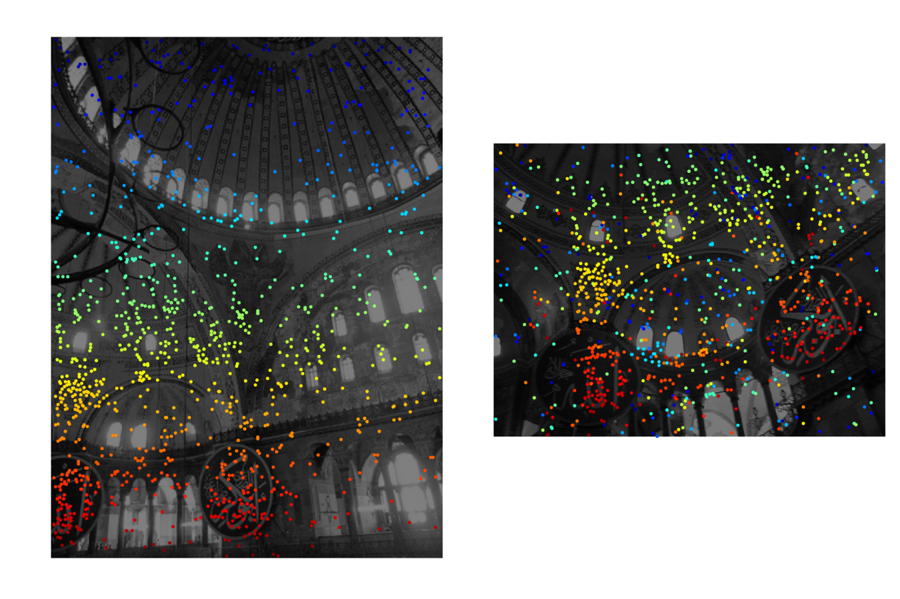

# Open Universal Correspondence Network

This repository contains the pytorch implementation of Universal Correspondence
Network, NIPS'16 (UCN) for geometric correspondences.  As we are releasing this
in 2019, we discarded the VGG network in favor of Residual Networks + U-Net.
Similarly, we use the hardest contrastive loss proposed in the Fully
Convolutional Geometric Features, ICCV'19 for fully convolutional metric
learning. This allows using the O(~10k) points for hardest negative mining for
all positives O(1k) per single image pair.

For the ease of implementation and use, we do not use the convolutional spatial
transformers (Rigid, SO(2), and TPS version of the deformable convolution)
originally proposed in the UCN.


## Installation and Data Preprocessing

```
# Follow the instruction on pytorch.org to install pytorch on your environment
git clone https://github.com/chrischoy/open-ucn.git
cd open-ucn
pip install -r requirements.txt
```

YFCC data download and processing

```
bash scripts/download_yfcc.sh /path/to/download/yfcc
python -m scripts.gen_yfcc --source /path/to/download/yfcc --target /path/to/preprocessed/yfcc
```

## Training the Open-UCN

Modify the arguments accordingly.

```
python train.py \
	--batch_size 1 \
	--iter_size 2 \
	--data_dir_raw /path/to/yfcc100m \
	--data_dir_processed /path/to/preprocessed \
	--num_hn_samples_per_batch 40000
```

## Testing the Open-UCN

Following demo code will download the UCN and test it on a few image pairs.
The output will be saved on `./ucn_outputs`.

```
python demo.py
```

### Output Image



To see more visualizations, visit [Youtube link](https://youtu.be/FisWYwbEtno).

### Heuristic Filtering Methods

A fully-convolutional model generates dense features. Similar to SIFT, it is crucial to filter out some false positive matches with heuristic methods. Here, we use `1. reciprocity test` and `2. stability test`.

1. Reciprocity test simply checks whether the nearest neighbors of image 1 in image 2 fall back to the vicinity of the keypoints in image 1. The idea is that if the feature is discriminative, then it should form a cycle.

2. Stability test selects features that are shifted randomly by 1 pixel. The idea is that if the features are discriminative, it should be invariant to translation noise.


## Model Zoo

Feel free to contribute to the model zoo by submitting your weights and the architecture.

**WARNING**: The models are train only on the YFCC dataset and are not guaranteed to work on other datasets with different statistics. (e.g., white background)

**WARNING**: The models assume a gray scale image in [-0.5, 0.5], i.e. Given an uint8 image x in [0, 255], scale to (x / 255 - 0.5).

| Dataset  | Architecture | Download link |
|:--------:|:------------:|:-------------:|
| YFCC100M | ResUNetBN2D2 | [link](https://node1.chrischoy.org/data/publications/ucn/ResUNetBN2D2-YFCC100train-100epoch.pth) |


## Citing this work

The Fully Convolutional Features for 2D Correspondences

```
@incollection{UCN2016,
    title = {Universal Correspondence Network},
    author = {Choy, Christopher B and Gwak, JunYoung and Savarese, Silvio and Chandraker, Manmohan},
    booktitle = {Advances in Neural Information Processing Systems 29},
    year = {2016},
}
```

Fully Convolutional Metric Learning and Hardest Contrastive Loss

```
@inproceedings{FCGF2019,
    author = {Christopher Choy and Jaesik Park and Vladlen Koltun},
    title = {Fully Convolutional Geometric Features},
    booktitle = {ICCV},
    year = {2019},
}
```

Open-source Pytorch Implementation

```
@misc{
    author = {Christopher Choy and Junha Lee},
    title = {Open Universal Correspondence Network},
    howpublished={\url{https://github.com/chrischoy/open-ucn}},
    year = {2019},
}
```

## License

MIT License
